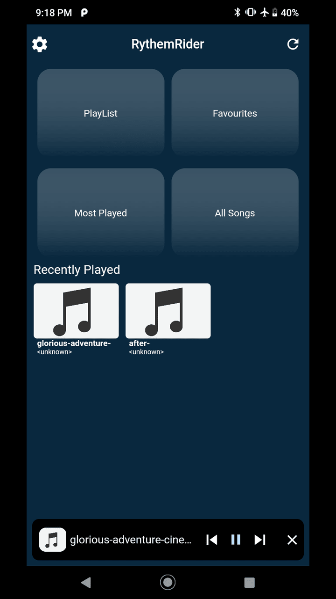
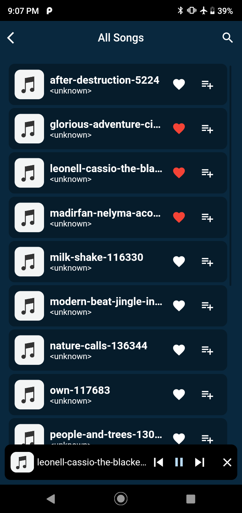
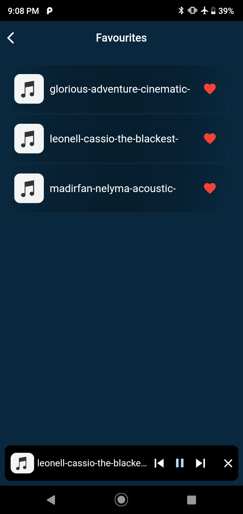
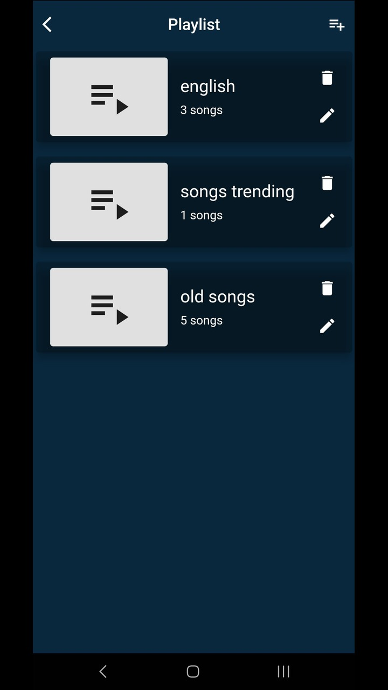
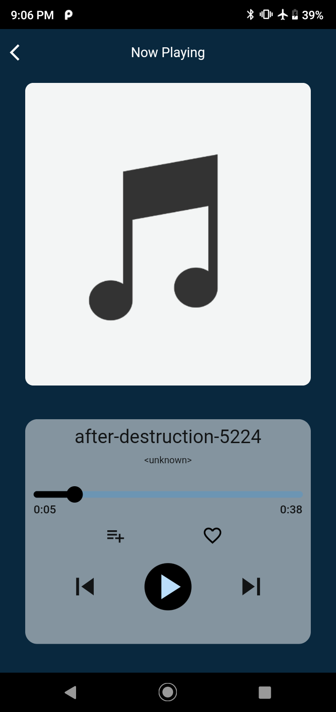

# RythemRider

A flutter music player app

RhythmRider is all about making it easy for you to enjoy your music collection. You can create playlists, mark your favorite songs, keep track of your most-played tunes, and see your recently played tracks.

- Used Bloc to handle state management and followed DDD Architecture..
- Hive database used for CRUD operations.
- Player functions -  play/pause, next/prev ,add to favorites , add to playlist.

Home Screen

All Songs Screen

Favourites Screen

Playlists Screen

Now Playing Screen

